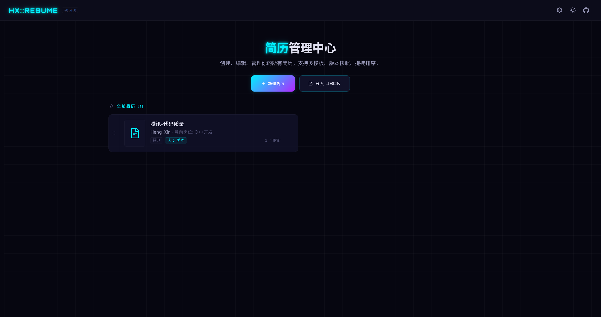
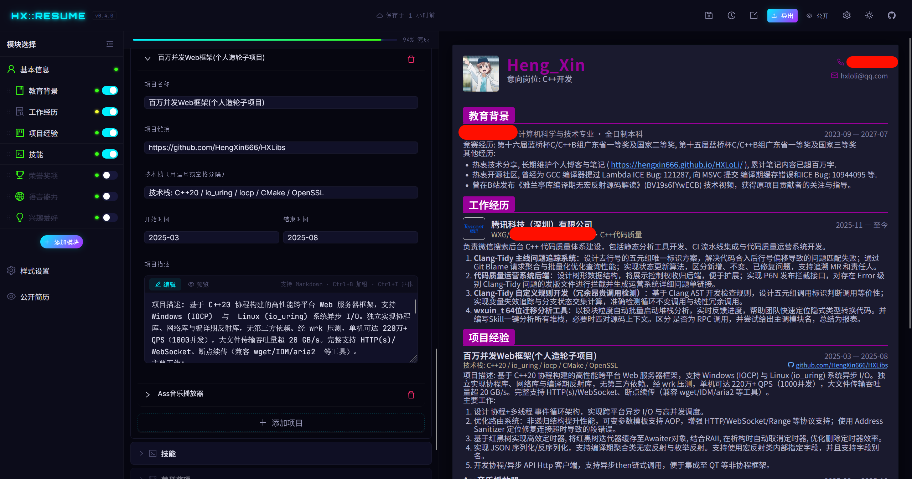
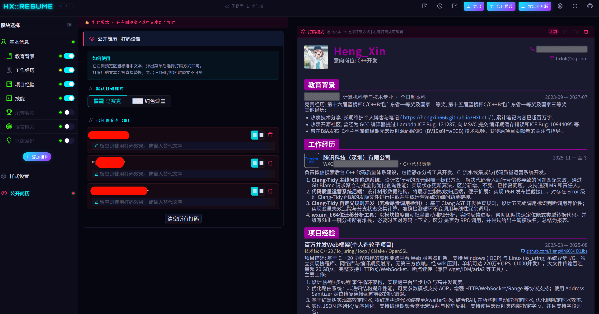
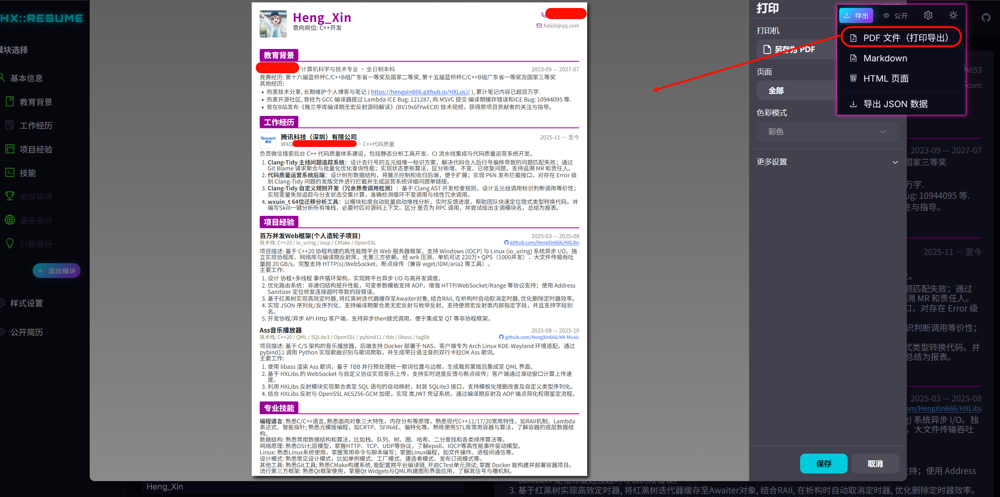
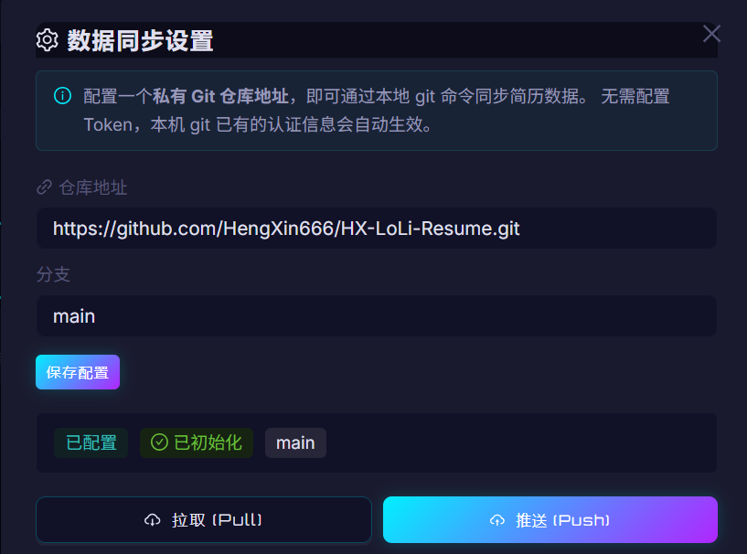

<div align="center">

# 🌌 HX::Resume

**现代化在线简历制作平台**

编辑、预览、导出，一站搞定。

[](LICENSE)
[](https://react.dev/)
[](https://www.typescriptlang.org/)
[](https://fastapi.tiangolo.com/)
[](https://vitejs.dev/)

<br />

[🚀 在线体验](https://hengxin666.github.io/HX-Resume/) · [📖 开发文档](docs/DEVELOPMENT.md) · [🐛 反馈问题](https://github.com/HengXin666/HX-Resume/issues)

<br />



</div>

---

## ✨ 功能亮点

<table>
<tr>
<td width="50%">

### 🎨 可视化编辑

所见即所得的实时编辑体验，左侧编辑、右侧即时预览，支持 Markdown 富文本。

</td>
<td width="50%">

### 📄 多格式导出

一键导出为 **PDF** / **HTML** / **Markdown** / **JSON**，满足各种投递场景。

</td>
</tr>
<tr>
<td>

### 🎭 隐私打码模式

公开分享简历时自动打码敏感信息（姓名、电话、邮箱），保护个人隐私。

</td>
<td>

### 🔄 Git 数据同步

通过本地 Git 命令将数据同步至私有仓库，**代码开源，数据私有**。

</td>
</tr>
<tr>
<td>

### 🌓 暗黑 / 亮色模式

赛博朋克暗黑主题 + 清爽亮色模式，一键切换。

</td>
<td>

### 📋 多简历管理

创建、管理多份简历，支持版本快照和拖拽排序。

</td>
</tr>
</table>

## 📸 界面预览

<div align="center">

### 简历编辑器



<br /><br />

### 隐私打码模式



<br /><br />

### 多格式导出



<br /><br />

### 数据同步



</div>

## 🏗️ 技术架构

```
┌─────────────────────────────────────────────────────┐
│                    Frontend                         │
│  React 19  ·  TypeScript  ·  Vite 8  ·  Ant Design  │
│  Zustand  ·  dnd-kit  ·  react-markdown             │
├─────────────────────────────────────────────────────┤
│                    Backend                          │
│  FastAPI  ·  SQLAlchemy  ·  SQLite  ·  Pydantic     │
├─────────────────────────────────────────────────────┤
│                   Export Engine                     │
│  html2canvas  ·  jsPDF  ·  Markdown  ·  HTML        │
├─────────────────────────────────────────────────────┤
│                    Data Sync                        │
│  Local Git CLI  →  Private Repository               │
└─────────────────────────────────────────────────────┘
```

## ⚡ 快速开始

> 详细文档请参阅 [📖 开发指南](docs/DEVELOPMENT.md)

```bash
# 克隆仓库
git clone https://github.com/HengXin666/HX-Resume.git
cd HX-Resume

# 启动前端
cd frontend
pnpm install && pnpm dev

# 启动后端（新终端）
cd backend
uv sync && uv run fastapi dev app/main.py
```

或者直接访问 **[🌐 在线 Demo](https://hengxin666.github.io/HX-Resume/)** 体验纯前端模式（无需后端）。

## 🤝 参与贡献

欢迎任何形式的贡献！

1. **Fork** 本仓库
2. 创建特性分支 (`git checkout -b feat/amazing-feature`)
3. 提交更改 (`git commit -m '[feat] add amazing feature'`)
4. 推送到分支 (`git push origin feat/amazing-feature`)
5. 提交 **Pull Request**

## 📄 许可证

本项目基于 [MIT License](LICENSE) 开源。

---

<div align="center">

**如果这个项目对你有帮助，请点个 ⭐ Star 支持一下！**

Made with ❤️ by [HengXin666](https://github.com/HengXin666)

</div>
