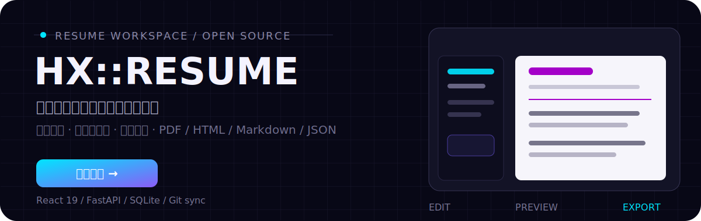
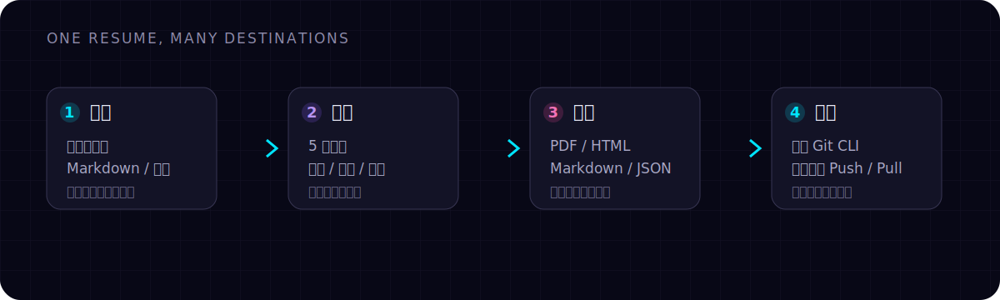

<div align="center">



<p>
  <a href="https://hengxin666.github.io/HX-Resume/">在线体验</a> ·
  <a href="docs/DEVELOPMENT.md">开发指南</a> ·
  <a href="https://github.com/HengXin666/HX-Resume/issues">反馈问题</a>
</p>

<p><sub>编辑一次 · 多模板确认 · 按需导出 · 可选私有同步</sub></p>

<p>
  
  
  
  
</p>

</div>

HX-Resume 是一个开源的在线简历工作台：在同一块屏幕里编辑内容、实时检查排版，并将结果导出为适合投递、分享或继续加工的多种格式。纯前端模式可直接运行在 GitHub Pages；启用后端后，还能把简历数据同步到自己的私有 Git 仓库。

> 适合需要持续维护多份简历、在不同岗位间切换版本，或希望把个人数据掌握在自己手中的开发者。

## 先看它能做什么

<p align="center">
  
</p>

| 编辑 | 预览 | 输出 | 数据边界 |
| --- | --- | --- | --- |
| 所见即所得编辑、Markdown 富文本、拖拽排序 | 5 套模板、暗色 / 亮色主题、实时分页预览 | PDF、HTML、Markdown、JSON | 公开分享自动打码；完整模式支持 Git 私有仓库同步 |

## 核心能力

- **多份简历，一处管理**：创建、排序、复制简历，并保留版本快照。
- **所见即所得直接编辑**：点击成品简历中的文字即可修改，内容与最终版式始终保持一致。
- **模板随时切换**：Classic、Modern、Minimal、Creative、Professional 五种模板覆盖不同投递场景。
- **公开也能保护隐私**：分享前开启公开模式，姓名、电话、邮箱等敏感信息自动打码。
- **导出不锁定格式**：按需导出 PDF、HTML、Markdown 或 JSON，方便投递、发布和迁移。
- **代码开源，数据私有**：后端以本地 Git 管理简历数据，可 Push / Pull 到你自己的私有仓库。

## 新增：所见即所得编辑

进入简历编辑页后，右侧工具栏提供 **直接编辑** 模式。开启后，模块栏和表单栏会自动隐藏，简历画布铺满工作区；此时无需在表单与预览之间来回切换，直接点击简历中的文字即可修改。

### 如何使用

1. 编辑页默认进入专注编辑模式；若当前显示传统表单，点击预览工具栏中的 **直接编辑** 即可进入。
2. 点击姓名、联系方式、个人简介、工作经历、项目、教育、技能、奖项、语言或自定义模块内容进行修改。
3. 普通单行字段按 `Enter` 或点击其他位置保存；Markdown 长文本按 `Ctrl/⌘ + Enter` 保存。
4. 编辑过程中按 `Esc` 可放弃本次修改。
5. 点击 **退出直接编辑**，即可恢复左侧模块栏和表单编辑器。

编辑内容会写回原有简历数据并进入自动保存链路。直接编辑支持全部 5 套模板，导出 PDF、HTML 或图片时不会出现编辑边框。

### 缩放与工作经历连接符

- 预览支持 **适合窗口** 以及 50%–200% 缩放；放大后可以完整横向、纵向滚动。
- 每条工作经历均可自定义部门与岗位之间的连接符，例如 `·`、`/`、`|` 或 `→`。
- 连接符既可以在工作经历表单中设置，也可以在直接编辑模式下点击修改。

> 公开简历模式用于选择文本并打码，因此会暂时退出所见即所得专注界面；关闭公开模式后可继续直接编辑。

## 界面预览

<p align="center">
  
</p>

<p align="center">
  
</p>

<p align="center">
  
</p>

<p align="center">
  
</p>

## 工作流：从内容到成品

<p align="center">
  
</p>

## 技术结构

前端负责编辑、状态与预览；后端只在需要本地持久化、字体管理或 Git 同步时参与。静态部署与完整部署共享同一套核心编辑体验。

| 层 | 组成 | 作用 |
| --- | --- | --- |
| UI | React 19 · Ant Design 6 · Vite 8 | 编辑器、模板、主题与交互 |
| 状态 | Zustand · dnd-kit · react-markdown | 内容状态、排序与 Markdown |
| 服务 | FastAPI · SQLAlchemy · SQLite | 本地数据、字体和同步配置 |
| 输出 | html2canvas · jsPDF · Markdown · HTML | 生成可投递、可迁移的结果 |

## 快速开始

### 直接使用

打开 **[在线 Demo](https://hengxin666.github.io/HX-Resume/)**。纯前端模式无需后端，核心编辑、预览、导出与 JSON 导入导出均可使用。

### 本地一键启动

需要 Node.js ≥ 18、Python ≥ 3.11 与 Git：

```bash
git clone https://github.com/HengXin666/HX-Resume.git
cd HX-Resume
sh ./run.sh
```

启动后，打开 `http://localhost:5173`，新建一份简历即可开始。首次只想验证前端时，也可以跳过后端，直接在 `frontend` 目录运行 `pnpm install && pnpm dev`。

前端默认运行在 `http://localhost:5173`，后端 API 默认运行在 `http://localhost:8000`。若要分别启动或调试，请参阅 [开发指南](docs/DEVELOPMENT.md)。

本地开发默认账号为 `admin`，默认密码为 `hx-resume-dev-password`。该密码仅用于开发模式；生产模式会拒绝使用默认密码启动。

### Docker Compose 一键部署

完整模式包含登录、SQLite 持久化、字体管理和 Git 同步。部署时只向宿主机暴露前端端口，后端 API 由前端 Nginx 在容器网络中反向代理。无需克隆源码，只需要一个 Compose 文件：

```bash
mkdir hx-resume && cd hx-resume
curl -O https://raw.githubusercontent.com/HengXin666/HX-Resume/main/docker-compose.yml
```

编辑 `docker-compose.yml`：

```yaml
AUTH_USERNAME: "admin"
AUTH_PASSWORD: "改成一段至少12位的强密码"
# 如需修改 Web 端口，只修改左侧数字
ports:
  - "8080:80"
```

然后一键启动：

```bash
docker compose up -d
```

打开 `http://服务器地址:8080`，使用 YAML 中设置的账号和密码登录。升级镜像时执行：

```bash
docker compose pull
docker compose up -d
```

```bash
docker compose ps          # 查看状态
docker compose logs -f     # 查看日志
docker compose down        # 停止，保留数据卷
```

安全与数据边界：

- 所有简历、字体和 Git 同步 API 均要求登录；写请求还会校验会话绑定的 CSRF token。
- 登录 Cookie 使用 HttpOnly 与 SameSite=Strict，密码不会保存到浏览器。
- SQLite、上传字体和 Git 数据目录使用 Docker 命名卷持久化。
- 未修改 YAML 中的占位密码时后端会拒绝启动；生产密码至少需要 12 位。
- 会话签名密钥由密码派生，修改密码并重建容器后，所有旧会话会自动失效。
- YAML 包含明文部署密码，请设置文件权限为 `chmod 600 docker-compose.yml`，不要公开提交。
- 使用雷池等 HTTPS 反向代理时，把 `SESSION_COOKIE_SECURE` 改为 `"true"`，上游地址指向 `http://服务器地址:8080`。

镜像由 GitHub Actions 自动发布到：

- `ghcr.io/hengxin666/hx-resume-frontend:latest`
- `ghcr.io/hengxin666/hx-resume-backend:latest`

## 静态版与完整模式

| 能力 | GitHub Pages 静态版 | 本地完整模式 |
| --- | :---: | :---: |
| 编辑、实时预览、主题切换 | ✅ | ✅ |
| PDF / HTML / Markdown / JSON 导出 | ✅ | ✅ |
| 多简历与版本快照 | ✅ | ✅ |
| 自定义字体上传 | — | ✅ |
| Git 私有仓库同步 | — | ✅ |
| 管理员登录与 API 鉴权 | — | ✅ |
| 数据存储 | 浏览器 `localStorage` | 本地 SQLite + `backend/data/` |

> Git 同步使用本机已有的 SSH 或 HTTPS 凭据，不需要在 HX-Resume 中配置 Token。简历数据目录已从主仓库排除。

## 你可以从哪里开始

- 想直接制作简历：打开 **[在线 Demo](https://hengxin666.github.io/HX-Resume/)**。
- 想本地开发：阅读 [开发指南](docs/DEVELOPMENT.md)，再运行 `sh ./run.sh`。
- 想了解数据同步：查看开发指南中的「私有数据同步」章节。
- 发现问题或有想法：提交 [Issue](https://github.com/HengXin666/HX-Resume/issues)。

## 开发与贡献

更完整的环境说明、目录结构、静态构建与部署步骤见 [docs/DEVELOPMENT.md](docs/DEVELOPMENT.md)。欢迎通过 Issue 或 Pull Request 参与改进：

1. Fork 仓库并创建特性分支。
2. 完成修改并在 `frontend` 中运行 `pnpm lint`、`pnpm build`。
3. 提交清晰的变更说明，再发起 Pull Request。

## 许可证

本项目基于 [MIT License](LICENSE) 开源。

<div align="center">

如果 HX-Resume 帮你更快完成了一份简历，欢迎点一个 ⭐ Star。

Made with ❤️ by [HengXin666](https://github.com/HengXin666)

</div>
